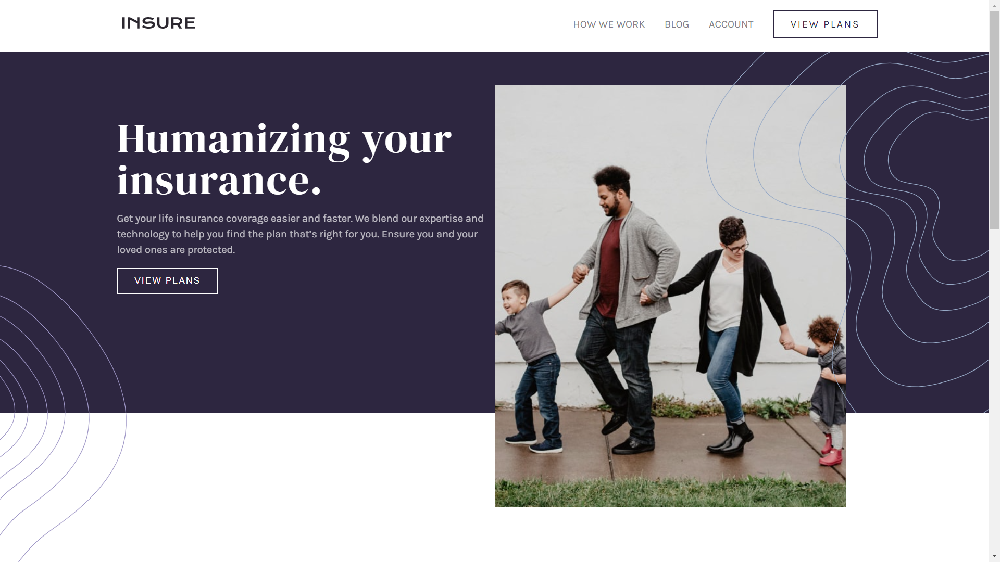

# Frontend Mentor - Insure landing page solution

This is a solution to the [Insure landing page challenge on Frontend Mentor](https://www.frontendmentor.io/challenges/insure-landing-page-uTU68JV8). Frontend Mentor challenges help you improve your coding skills by building realistic projects. 

## Table of contents

- [Overview](#overview)
  - [The challenge](#the-challenge)
  - [Screenshot](#screenshot)
  - [Links](#links)
- [My process](#my-process)
  - [Built with](#built-with)
  - [What I learned](#what-i-learned)
  - [Continued development](#continued-development)
  - [Useful resources](#useful-resources)
- [Author](#author)
- [Acknowledgments](#acknowledgments)

## Overview

### The challenge

Users should be able to:

- View the optimal layout for the site depending on their device's screen size
- See hover states for all interactive elements on the page

### Screenshot

### Links

- [Solution URL](https://www.frontendmentor.io/solutions/insure-landing-page-hVftnOquP)
- [Live Site URL](https://insure-landing-page-khaki.vercel.app/)

## My process

### Built with

- Semantic HTML5 markup
- CSS custom properties
- Flexbox
- Desktop-first workflow

### What I learned

- Responsive design
- CSS Flexbox
- A little javascript

### Useful resources

- [Florin Pop](https://www.youtube.com/watch?v=9HVKR_hK0nY&list=WL&index=35) - This helped me for adding a Javascript so I can implement the hamburger menu.
- [CSS Tricks](https://css-tricks.com/snippets/css/a-guide-to-flexbox/#background) - This is an amazing article which helped me finally understand the concepts of flexbox.

## Author

- Website - [Muhammad Elfanza](https://www.instagram.com/elfanthedev)
- Frontend Mentor - [@elfanthedev](https://www.frontendmentor.io/profile/elfanthedev)
- Twitter - [@mhmdelfnz](https://www.twitter.com/mhmdelfnz)

## Acknowledgments

- Mas Faldi
- Google and YouTube